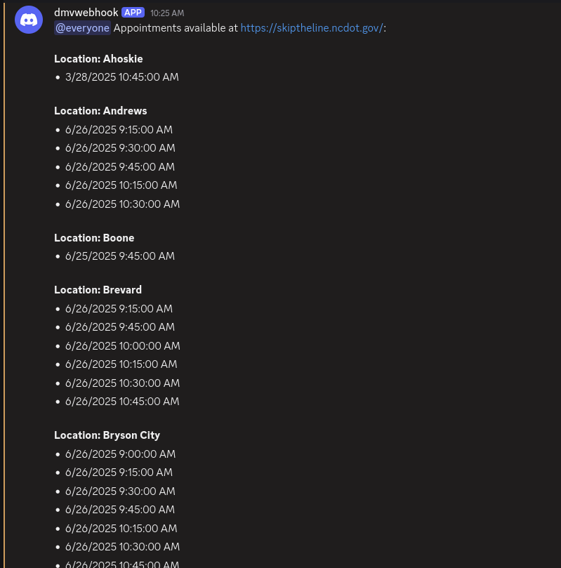

NC-DMV-Scraper is a tool you can use to become aware of DMV appointments right when they become available, without all the extra work of constantly manually monitoring the DMV website.



It uses selenium to scrape appointment locations, dates, and times, from https://skiptheline.ncdot.gov/.

I strongly recommend you set it up yourself, but if you are entirely unwilling to do that ( even though it is quite easy ), you could reach out to me ( tommy092464_62746 on discord, or via github issues ) and pay me like 5 bucks a month, with absolutely no uptime guarantees ( e.g. if my power, or internet go out, that sucks for you. ). 

If this tool helped you out a lot, consider buying me a coffee:

<a href="https://www.buymeacoffee.com/tommymcelroy" target="_blank"></a>

# Setup ( Native, no Docker ) 

If you have never heard of docker, then this is the tutorial you follow to set up the tool:

In order to set it up, you must first install Firefox, python, selenium, and the selenium geckodriver

https://www.mozilla.org/en-US/firefox/new/

https://www.python.org/downloads/

https://github.com/mozilla/geckodriver/releases

then, you must install the dependencies

open a terminal and run

```bash
pip3 install requests geopy selenium
```

if that does not work, try

```bash
python -m pip install requests geopy selenium
```

Then, download the code for this by clicking the green code button in the top right, and clicking download zip. Open that zip up, and extract it somewhere.

Then, you need to get the file path for the geckodriver you downloaded, open up scrapedmv.py in a texteditor, and replace the line that says this:

```python
GECKODRIVER_PATH = os.getenv('GECKODRIVER_PATH','YOUR_GECKODRIVER_PATH_HERE') # Replace with your geckodriver path
```

with your geckodriver path, like this:

```python
GECKODRIVER_PATH = '/home/tommy/.cache/selenium/geckodriver/linux64/0.35.0/geckodriver' # Replace with your geckodriver path
```

Your format will depend on your operating system, e.g. on windows it may be like `GECKODRIVER_PATH = 'C:/Users/tommy/Downloads/0.35.0/geckodriver.exe'` or something like that. if you are on Windows, you will likely be default get a format like C:\Users\tommy\Downloads\0.35.0\geckodriver.exe. you need to replace all of those \ with /, so that it looks like the above example. 


# Notification Setup

You can receive notifications via Discord or Slack when appointments become available. **Configure notifications using environment variables - no need to edit the Python script!**

## Quick Configuration (Recommended Method)

Set these environment variables before running the script:

**For Discord notifications:**
```bash
export NOTIFICATION_TYPE="discord"
export YOUR_DISCORD_WEBHOOK_URL="https://discord.com/api/webhooks/YOUR_ACTUAL_WEBHOOK_URL_HERE"
```

**For Slack notifications:**
```bash
export NOTIFICATION_TYPE="slack"
export YOUR_SLACK_WEBHOOK_URL="https://hooks.slack.com/services/YOUR/SLACK/WEBHOOK"
```

## Discord Setup

1. Go to Discord and create a webhook in a server you own (make a server if you don't have one)
2. Right click a channel → Edit Channel → Integrations → Webhooks → New Webhook → Copy Webhook URL
3. Set your environment variables (no script editing needed):

```bash
export NOTIFICATION_TYPE="discord"
export YOUR_DISCORD_WEBHOOK_URL="https://discord.com/api/webhooks/YOUR_ACTUAL_WEBHOOK_URL_HERE"
```

## Slack Setup

1. Go to your Slack workspace and create an Incoming Webhook:
   - Visit https://api.slack.com/apps
   - Click "Create New App" → "From scratch"  
   - Name your app (e.g., "NC DMV Bot") and select your workspace
   - Go to "Incoming Webhooks" → Toggle "Activate Incoming Webhooks" to On
   - Click "Add New Webhook to Workspace"
   - Choose the channel where you want notifications
   - Copy the webhook URL

2. Set your environment variables (no script editing needed):

```bash
export NOTIFICATION_TYPE="slack"
export YOUR_SLACK_WEBHOOK_URL="https://hooks.slack.com/services/YOUR/SLACK/WEBHOOK"
```

## Alternative: Edit Script Directly (Not Recommended)

If you prefer not to use environment variables, you can edit the script directly:

**For Discord:**
1. Open `scrapedmv.py` and find:
```python
NOTIFICATION_TYPE = os.getenv("NOTIFICATION_TYPE", "discord").lower()
YOUR_DISCORD_WEBHOOK_URL = os.getenv("YOUR_DISCORD_WEBHOOK_URL", "YOUR_WEBHOOK_URL_HERE")
```

2. Replace with:
```python
NOTIFICATION_TYPE = "discord"
YOUR_DISCORD_WEBHOOK_URL = "https://discord.com/api/webhooks/YOUR_ACTUAL_WEBHOOK_URL_HERE"
```

**For Slack:**
1. Open `scrapedmv.py` and find:
```python
NOTIFICATION_TYPE = os.getenv("NOTIFICATION_TYPE", "discord").lower()
YOUR_SLACK_WEBHOOK_URL = os.getenv("YOUR_SLACK_WEBHOOK_URL", "YOUR_SLACK_WEBHOOK_URL_HERE")
```

2. Replace with:
```python
NOTIFICATION_TYPE = "slack"
YOUR_SLACK_WEBHOOK_URL = "https://hooks.slack.com/services/YOUR/SLACK/WEBHOOK"
```

## Environment Variables for All Configuration

You can configure everything via environment variables without editing any code:
```bash
export NOTIFICATION_TYPE="discord"
export YOUR_DISCORD_WEBHOOK_URL="https://discord.com/api/webhooks/YOUR_ACTUAL_WEBHOOK_URL_HERE"
```

**For Slack:**
```bash
export NOTIFICATION_TYPE="slack"
export YOUR_SLACK_WEBHOOK_URL="https://hooks.slack.com/services/YOUR/SLACK/WEBHOOK"
```

**Additional Configuration:**
```bash
# Location filtering
export YOUR_ADDRESS="123 Main Street, Charlotte, NC"
export DISTANCE_RANGE="25"

# Appointment type  
export APPOINTMENT_TYPE="ID Card"

# Date/time filtering
export DATE_RANGE="4w"  # 4 weeks from today
export TIME_RANGE_START="08:00"
export TIME_RANGE_END="17:00"

# Other settings
export BASE_INTERVAL_MINUTES="10"
export PROOF_OF_LIFE="False"
```

Then run the scraper:
```bash
python3 scrapedmv.py
```

The scraper will run every 10 minutes or so and start the scraping process. That is all you have to do to get it up and running!

# Appointment Type Configuration

You can choose the type of appointment using the `APPOINTMENT_TYPE` environment variable (recommended) or by editing the script.

**Using Environment Variable (Recommended):**
```bash
export APPOINTMENT_TYPE="ID Card"
```

**Available appointment types:**
- `"Driver License - First Time"`
- `"ID Card"`
- `"Fees"`
- `"Non-CDL Road Test"`
- `"Motorcycle Skills Test"`
- `"Legal Presence"`
- `"Permits"`
- `"Teen Driver Level 1"`

**Alternative: Edit Script Directly**

You can also change the appointment type by editing `scrapedmv.py` on the line where it says:

```python
APPOINTMENT_TYPE = os.getenv("APPOINTMENT_TYPE", "Driver License - First Time")
```

Change it to:
```python
APPOINTMENT_TYPE = "ID Card"
```

**Important:** Make sure you get the exact name from skiptheline.ncdot.gov. For example, `"Non CDL Road Test"` would fail because it should be `"Non-CDL Road Test"` (with the hyphen).

You can also configure this and notifications with Docker using environment variables:

**Discord notifications:**
```bash
docker run -e NOTIFICATION_TYPE="discord" -e YOUR_DISCORD_WEBHOOK_URL="PUT_YOUR_WEBHOOK_URL_HERE" -e APPOINTMENT_TYPE="Teen Driver Level 1" ghcr.io/tmcelroy2202/nc-dmv-scraper:latest
```

**Slack notifications:**
```bash
docker run -e NOTIFICATION_TYPE="slack" -e YOUR_SLACK_WEBHOOK_URL="PUT_YOUR_SLACK_WEBHOOK_HERE" -e APPOINTMENT_TYPE="ID Card" ghcr.io/tmcelroy2202/nc-dmv-scraper:latest
```


# Filtering
There is also appointment filtering you can apply in that file:

You can set an address, and a distance range, and have it only look for dmv locations within that range of miles from the given address

You would do that by changing these values

```python
YOUR_ADDRESS = os.getenv("YOUR_ADDRESS")
DISTANCE_RANGE_MILES_STR = os.getenv("DISTANCE_RANGE")
```

so that they looked like this:

```python
YOUR_ADDRESS = "1337 Testing Lane, Charlotte NC"
DISTANCE_RANGE_MILES_STR = "40"
```

You can also set specific time and date ranges to scan for, by changing these lines:

```python
DATE_RANGE_START_STR = os.getenv("DATE_RANGE_START")
DATE_RANGE_END_STR = os.getenv("DATE_RANGE_END")
DATE_RANGE_RELATIVE_STR = os.getenv("DATE_RANGE")
TIME_RANGE_START_STR = os.getenv("TIME_RANGE_START")
TIME_RANGE_END_STR = os.getenv("TIME_RANGE_END")
```

examples of things you could do with them are:

```python
DATE_RANGE_START_STR = "01/23/2025"
DATE_RANGE_END_STR = "09/23/2025"
```

to only show appointments from 01/23/2025 to 09/23/2025.

or

```python
DATE_RANGE_RELATIVE_STR = "2w"
```

to only show appointments in the next 2 weeks ( could also do 1m for one month, or 5d for 5 days, etc. ) 

or

```python
TIME_RANGE_START_STR = "3:00"
TIME_RANGE_END_STR = "19:00"
```

to only show appointments from 3:00AM to 7:00PM.

You can also edit the intro message, by default it is:
"@everyone Appointments available at https://skiptheline.ncdot.gov:\n"
but you can change it by editing the file ( or by environment variables ) via this line:

```python
INTRO_MESSAGE = os.getenv("INTRO_MESSAGE", f"@everyone Appointments available at {NCDOT_APPOINTMENT_URL}:\n")
```

This allows you to, for example, remove the @everyone ping.

```
INTRO_MESSAGE = f"Appointments available at {NCDOT_APPOINTMENT_URL}:\n"
```

You can also make it notify you after it runs even when appointments arent available, if that gives you peace of mind to make sure the script is still running, by editing this line ( or via environment variables ):

```python
PROOF_OF_LIFE = os.getenv("PROOF_OF_LIFE", False)
```

if you set it to true, it will notify you after each run


```python
PROOF_OF_LIFE = True
```

# Docker

## Pre-built Image

**For Discord notifications:**
```bash
docker run -e NOTIFICATION_TYPE="discord" -e YOUR_DISCORD_WEBHOOK_URL="PUT_YOUR_WEBHOOK_URL_HERE" ghcr.io/tmcelroy2202/nc-dmv-scraper:latest
```

**For Slack notifications:**
```bash
docker run -e NOTIFICATION_TYPE="slack" -e YOUR_SLACK_WEBHOOK_URL="PUT_YOUR_SLACK_WEBHOOK_HERE" ghcr.io/tmcelroy2202/nc-dmv-scraper:latest
```

**With custom filtering:**
```bash
docker run \
  -e NOTIFICATION_TYPE="discord" \
  -e YOUR_DISCORD_WEBHOOK_URL="PUT_YOUR_WEBHOOK_URL_HERE" \
  -e YOUR_ADDRESS="1337 Testing Lane, Charlotte NC" \
  -e DISTANCE_RANGE=50 \
  -e APPOINTMENT_TYPE="ID Card" \
  -e DATE_RANGE="4w" \
  -e TIME_RANGE_START="8:00" \
  -e TIME_RANGE_END="17:00" \
  ghcr.io/tmcelroy2202/nc-dmv-scraper:latest
```

## Build Locally

If you wish to build the docker container locally, clone the repo, cd into it, and:

**Docker build:**
```bash
docker build -t nc-dmv-scraper .
```

**Run container:**
```bash
docker run -e NOTIFICATION_TYPE="discord" -e YOUR_DISCORD_WEBHOOK_URL="PUT_YOUR_WEBHOOK_URL_HERE" nc-dmv-scraper
```

# Docker Compose

If you wish to run via docker compose, you can just git clone this repository, configure your notification settings in docker-compose.yml, then run:

```bash
docker compose up -d
```

The docker-compose.yml file includes configuration for both Discord and Slack notifications. Simply update the appropriate webhook URL and set the notification type:

```yaml
services:
  dmv-scraper:
    build: .  # Use local Dockerfile
    container_name: nc-dmv-scraper
    environment:
      # --- NOTIFICATION SETTINGS ---
      # Choose your notification platform: "discord" or "slack"
      NOTIFICATION_TYPE: "discord"
      
      # Discord webhook (required if using Discord notifications)
      YOUR_DISCORD_WEBHOOK_URL: "YOUR_WEBHOOK_URL_HERE"
      
      # Slack webhook (required if using Slack notifications)  
      YOUR_SLACK_WEBHOOK_URL: "YOUR_SLACK_WEBHOOK_URL_HERE"

      # --- LOCATION & APPOINTMENT SETTINGS ---
      YOUR_ADDRESS: "1337 Testing Lane, Charlotte NC"
      DISTANCE_RANGE: 50
      APPOINTMENT_TYPE: "ID Card"

      # --- DATE & TIME FILTERING ---
      DATE_RANGE: "4w"  # 4 weeks from today
      # DATE_RANGE_START: "03/23/2025"
      # DATE_RANGE_END: "09/23/2025"
      # TIME_RANGE_START: "8:00"
      # TIME_RANGE_END: "19:00"
      
      # --- ADVANCED SETTINGS ---
      BASE_INTERVAL_MINUTES: 10
      PROOF_OF_LIFE: "False"
    restart: unless-stopped
```

**For Slack notifications:** Change `NOTIFICATION_TYPE` to `"slack"` and set your `YOUR_SLACK_WEBHOOK_URL`.

# Beta

I have written a purely requests based version of this scraper, which does not require selenium, but it also has not gotten extensive testing yet. If you want to try it out, have a look at https://github.com/tmcelroy2202/NC-DMV-Scraper/issues/15, and have a look at beta_requests_scrape.py.
